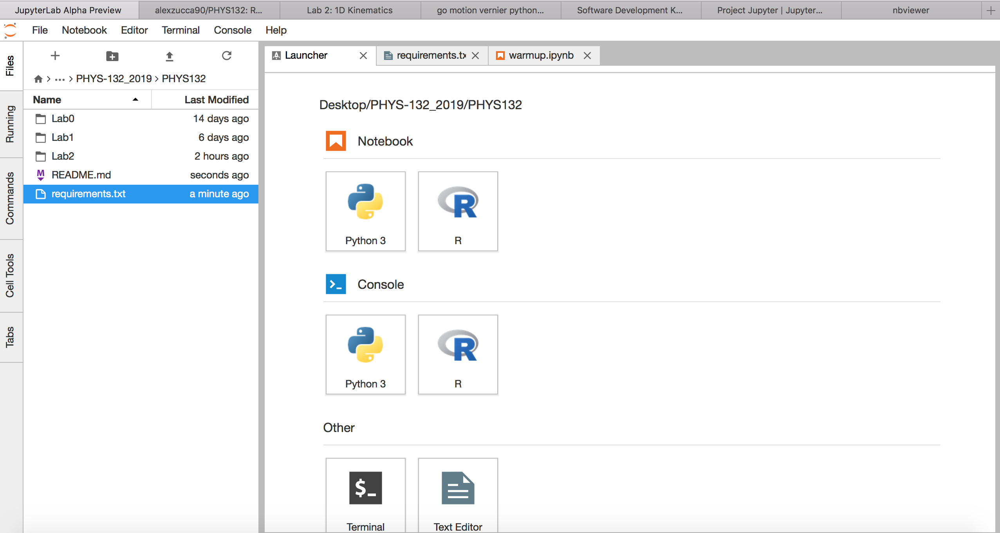
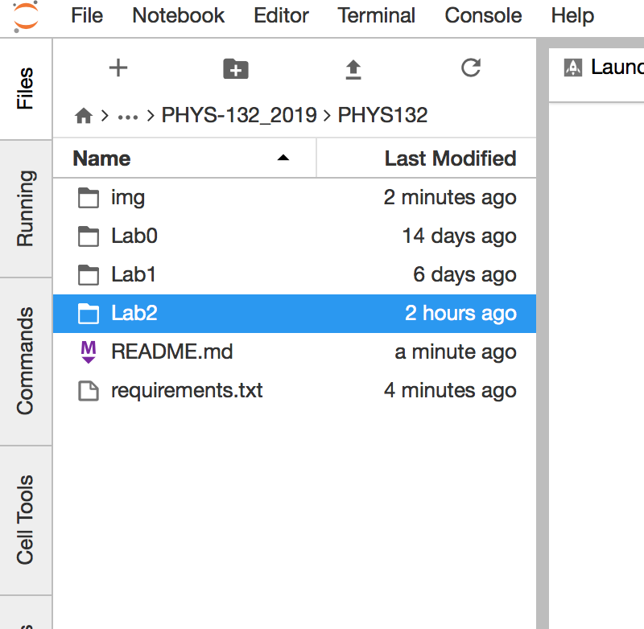
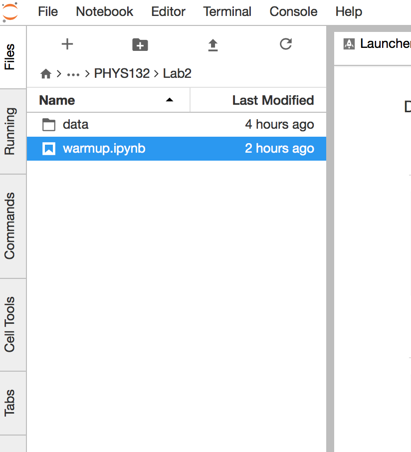

PHYS 132 repository
================

[](https://mybinder.org/v2/gh/alexzucca90/PHYS132/master)

This is the repo for the PHYS 132 lab. 

## Table of contents
* [1. Introduction](#1-introduction)
* [2. Instructions for Students with No Python](#2-instructions-for-students-with-no-python)
* [3. Instructions for Students with Python](#3-instructions-for-students-with-python)
    * [3.1. Windows Users](#3-1-windows-users)
    * [3.2. Mac Users](#3-1-mac-users)
    * [3.3. Run an Example](#3-3-run-an-example)

## 1. Introduction
This is an experiment for the PHYS 132 lab at Simon Fraser University. 

I am going to provide some Jupyter notebooks to do the data analysis in the labs. 

Below you find the instructions to run one of the Jupyter notebook on your laptop/computer or what you are actually using. If you don't want to install Python on your laptop (it may take a while to install it), just use the instructions for students with no python. This repository is integrated in Binder.


## 2. Instructions for Students with no Python

At the moment click the Binder launch icon at the top of  this README. You can run the scripts online, although you cannot use your own data at the moment. 

## 3. Instructions for Students with Python
If you want to install Python on your computer you are welcome to do so. If you are majoring in Physics, the chances to come across Python in your career will be very high. It is the standard in data analysis and it's an open source programming language.  The documentation is also extremely rich. 

### 3.1. Windows Users
If you have Windows, then just follow the instructions for Students with no Python. I will try to integrate this when I have some more time.

### 3.2. Mac/Linux Users
If you have a Unix-based laptop, running Mac OS or a Linux distro, please follow this part.

#### 3.2.1 Installing Python
First of all you need to install a Python distribution on your computer. I suggest to install [Anaconda](https://www.anaconda.com). See [this page](https://www.anaconda.com/distribution/) to install Anaconda.

#### 3.2.2.Getting a Github Account
Open an accound on Github and set it up on your terminal. Please follow [these instructions](https://help.github.com/articles/set-up-git/).

#### 3.2.3.Running the Notebooks on your terminal.

Now you are ready to go! To install the software contained in this repo, just run this on your terminal:

```bash
git clone https://github.com/alexzucca90/PHYS132.git
cd PHYS132
```
Now you are in the directory for this course.  From terminal, run the following command:
```bash
jupyter lab
```

You are going to be redirected to your browser on the following page
<p align="center">

</p>

Now you can run the notebooks. See next section for an Examples

#### 3.3. Run an Example

Click on the [Lab2](/Lab2/) directory 
<p align="center">

</p>

and then click on the [warmup.ipynb](/Lab2/warmup.ipynb) notebook as below:

<p align="center">

</p>

Now you can edit the warmup acticity notebook!

## 4. Labs

THIS IS STILL WORK IN PROGRESS

### 4.1. Lab 1: Density.

### 4.2. Lab 2: 1D Kinematics.

### 4.3. Lab 3: Fan carts.


Repo created and maitained by [Alex Zucca](https://github.com/alexzucca90).

<p align="left">
<a href="http://www.sfu.ca/physics.html"></a>
</p>


